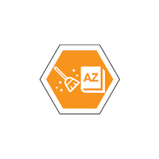

<!-- README.md is generated from README.Rmd. Please edit that file -->

```{r, echo = FALSE}
knitr::opts_chunk$set(
  collapse = TRUE,
  comment = "#>",
  fig.path = "README-"
)
```

# tidylex 

[](https://travis-ci.org/CoEDL/tidylex)
[](https://cran.r-project.org/package=tidylex)
[](https://codecov.io/github/CoEDL/tidylex?branch=master)

## Overview

The goal of tidylex is to help foster collaboration between R programmers and lexicographers who are interested in cleaning/transforming dictionary data stored as Toolbox-style backslash-coded data (example taken from NLTK's `rotokas.dic`): 

```
\lx kaa
\ps V.A
\ge gag
\gp nek i pas

\lx kaa
\ps V.B
\ge strangle
\gp pasim nek
```

We follow David Robinson's educational philosophy of "<a href="http://varianceexplained.org/r/teach-tidyverse/#get-students-doing-powerful-things-quickly" target="_blank">Get students doing powerful things quickly</a>" and provide a set of convenience functions and accompanying walkthroughs to help teams get started *quickly* on processing their dictionary data within the [tidyverse](https://www.tidyverse.org/) framework.

## Why is tidylex needed?

- Toolbox-style files are commonly used in description of under-resourced languages
- Almost always hand-edited, so have lots of inconsistencies, so data must be cleaned
- We introduce a step-by-step walkthrough on using modern data engineering tools to clean and maintain cleanliness of lexicon file
- Stepping stone for
    - programmers for working with lexicographical data
    - lexicographers for working with Git(Hub)/Travis CI, etc.

## Installation

You can install tidylex from github with:

```{r gh-installation, eval = FALSE}
# install.packages("devtools")
devtools::install_github("CoEDL/tidylex")
```

## Example

### Verify all headwords are unique

Suppose you require that all headwords (`\lx` items) be unique, and all homographs be explicitly marked (e.g. `\lx kaa#1`, `\lx kaa#2`). The example below shows how we can read a lexicon file, keeping only the `lx` lines (using the `filter` command), and create a tally for the various values of the `lx` field (notice `\lx kaa` occurs twice).

```{r homograph, message=FALSE}
library(tidylex)

lexicon <-
'\\lx kaa
\\ps V.A
\\ge gag
\\gp nek i pas

\\lx kaa
\\ps V.B
\\ge strangle
\\gp pasim nek'

read_lexicon(file  = lexicon,
             regex = "\\\\([a-z]+)\\s(.*)",
             into  = c("code", "value")) %>%
    filter(code == "lx") %>%
    group_by(value) %>% 
    tally()
    
   
```
